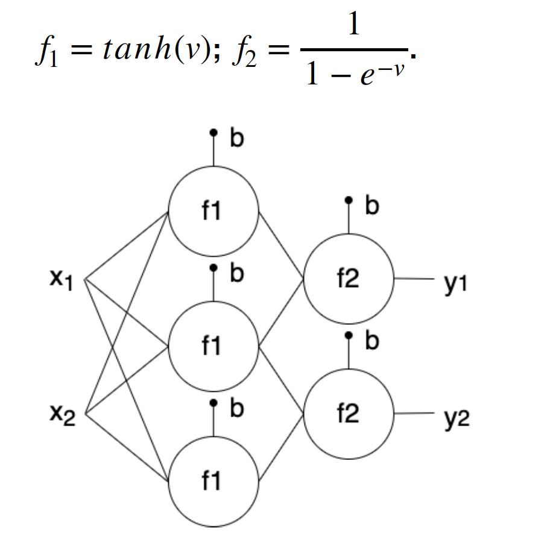

# AI DEVELOPER TEST
*Name: Kenneth Rejopachi*

**Requirements:**
`pip3 install -r requirements.txt`
> Main tasks were written in *Python* in *Jupyter Notebooks*. All the requirements needed to run the code are in the file specified above. 

> Multilayer Preceptron: 

